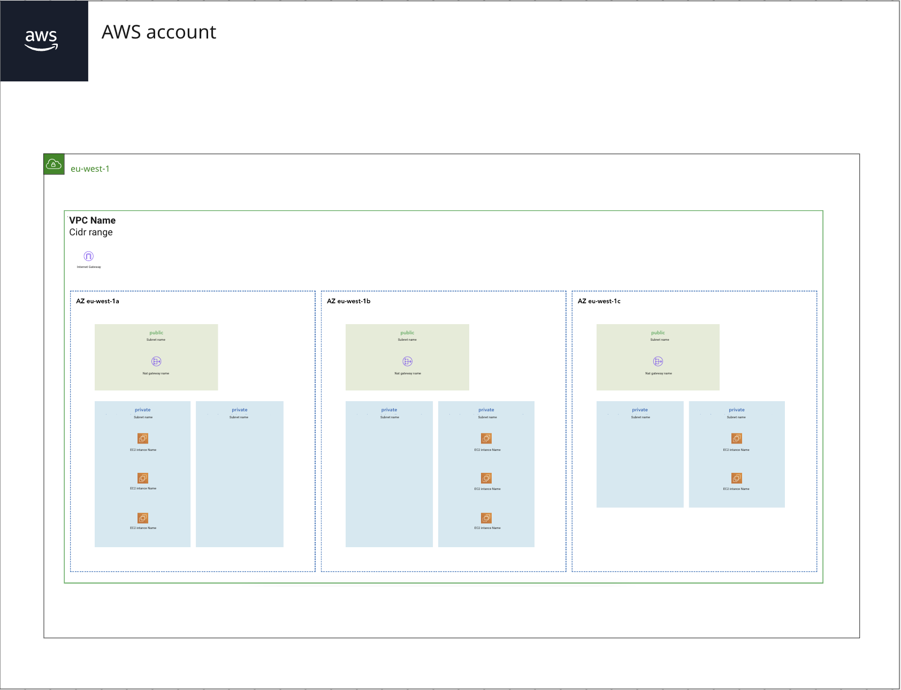

# Inventori

Inventori is a small application that makes your current AWS infrastructure visible by making
API requests via the Javascript SDK of AWS. In many organizations development teams have a good overview
of the newer parts of the infrastructure, but it becomes blurry when all the infrastructure needs to be visualized.
And who are we kidding, documenting is not the best part of the job.
Inventori tries to solve this for a few of the many components of the AWS infrastructure as is.
By dynamically visualizing your infrastructure, you always have the real world visualization and not a months, weeks, days or even hour old overview.

## Capabilities

- [x] List VPCs
- [x] List availability zones
- [x] List public and private subnets by using the route tables
- [x] List EC2 instances
- [x] List gateways (Internet and NAT)
- [x] List RDS instances
- [x] List DynamoDb tables
- [x] List S3 buckets
- [x] List Lambda functions
- [x] List Cloudfront distributions
- [x] List Api Gateways (Legacy and V2)
- [x] List SNS topics
- [x] List SQS queues

## How to run

Inventori consists of a frontend and backend.
The backend is responsible for making the API calls towards AWS,
and the frontend handles the visualization of the components in relationship to eachother.

1. `npm run backend` will start the nodemon express backend server.
2. `npm run start` will start the React development server.
3. Create your short-lived credentials with the aws sts command presented on the credentials screen.
4. Done! The app will start fetching the results and within 5-20 seconds you should have an overview of a single account for default region `eu-west-1`.

You will need to assume a read only role within your AWS account like the SecurityAuditRole to list
all the resources within the AWS accounts.

## Roadmap

1. Finalize the remaining core resources (eks labeling, route53, iam user and roles, WAF, API Gateways)..
2. Implement better styling (dynamic grid layout based on public private subnet count.
3. Store state in database to limit the API calls and support multi account support.
4. Support docker setup.
5. Develop way to visualize route tables and therefor flow on network level.
6. Develop way to visualize IAM policies which result in (cross) account relationships.
